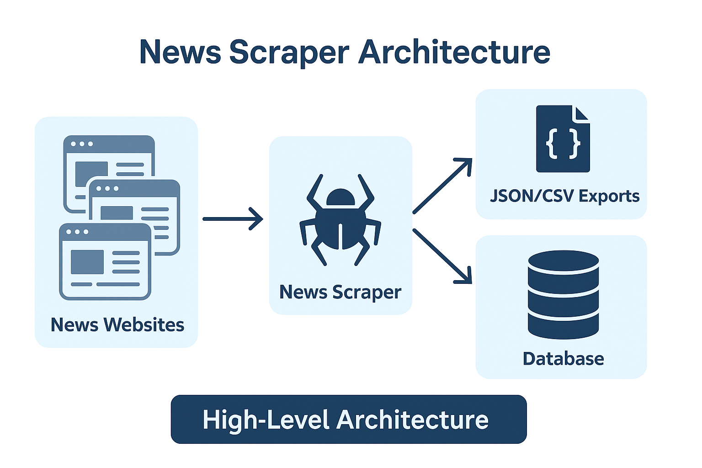

# News Scraper – Python & Selenium

  
  
  

>A News Scraper built with Python, Selenium, and BeautifulSoup to extract headlines, full articles, authors, categories, and publish dates from multiple news websites.
Automates content collection into structured JSON/CSV formats for research, market analysis, sentiment tracking, and AI dataset generation.

  

## Introduction
The **News Scraper** is built with **Python, Selenium & BeautifulSoup** to extract:
- Headlines & article summaries
- Full article content
- Authors, categories, & publish dates
- News from multiple sources (blogs, portals, aggregators)
It automates browsing and delivers **structured JSON/CSV outputs** for market research, data pipelines, sentiment analysis, and AI training datasets.

---

## Features
| Feature               | Description                                        |
|------------------------|----------------------------------------------------|
| Multi-Source Support   | Scrape news from multiple outlets & categories     |
| Headline Extraction    | Collect titles, authors, and publishing dates      |
| Full Content Parsing   | Extract complete articles for deeper analysis      |
| Human-Like Automation  | Random delays, scrolling, pagination               |
| Scalable Workflow      | Collect 1000s of articles efficiently             |
---

  

## Architecture

  

## Success Stories & Testimonials
### Client Results
> "The News Scraper transformed how we monitor global headlines. Our team collected 50,000+ articles across 20+ news sites in a single week, saving countless hours of manual curation!"
> — *Digital Media Agency*

> "We integrated the scraper into our sentiment analysis pipeline. Data quality improved instantly, giving us real-time insights into politics, finance, and tech trends."
> — *AI Research Lab*

> "Custom features like category-based scraping and multilingual support were implemented flawlessly. A must-have tool for content aggregation and media research."
> — *Content Intelligence Platform*

---

### Performance Metrics
- **90% faster article collection** compared to manual copy-paste
- **500k+ news articles processed** across multiple sources
- **70% reduction in editorial research costs**
- **10x scalability** with automation workflows
- **98% accuracy** in JSON/CSV structured exports
- **Reliable uptime** with cross-platform support

## Contact:

  
  
  

##

:star: Found this scraper helpful? Star the repository and share it with your network!

:briefcase: Need a custom News scraping solution? Contact me today for a free consultation and tailored quote!

:newspaper: News Scraper – Professional News & Media Data Extraction System
